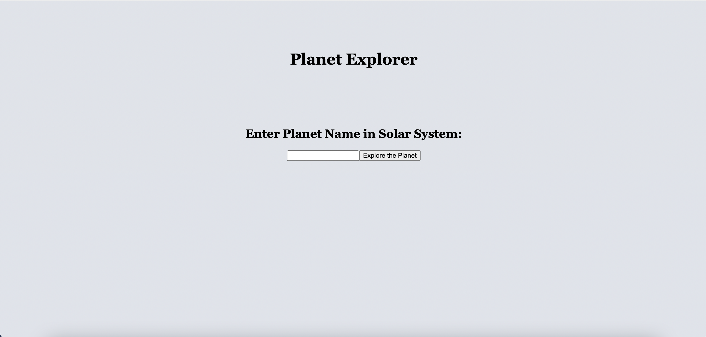

# Documentation of Planet Explorer Website Version 1.0

## Website link: https://aibartt.github.io/Connection_Lab_Aibar/Project1Week3

## Wireframe of Website: 

## What I learned from this Assignment?

With the help of this project, I learned a lot about Media queries - how can we make our website responsive. In practice, I used addEventListener() method for adding event handlers in web pages. The <button> element has an event called 'click' that fires when the user clicks the button. Objects that can fire events have an addEventListener() method. In my website I created image and text carousel of places to visit in Abu Dhabi using Event Arrays Images and Text. I did some progress on learning basics of JavaScript language, how to declare and initialize our variables, lists and etc. I also learned some Document Object Model (DOM) concepts and logic of accessing different parts of the website.
  
  I used one button element to create two event-driven user interactions that are handled in a script.js file. When the user clicks on the Explore Button, it depicts one of the tourist destinations in Abu Dhabi with a concise description, and when you click the button, it shows the following tourist destinations with its corresponding description. The second event-driven user interaction is Abu Dhabi COVID Rules Accordian. I learned how to create accordians using JavaScript and that accordions are useful when you want to toggle between hiding and showing large amount of content.
  
  

## Code index.html
  
	<!DOCTYPE html>
	<html lang="en">
	<head>
    		<meta charset="UTF-8">
   	 	<meta http-equiv="X-UA-Compatible" content="IE=edge">
   		 <meta name="viewport" content="width=device-width, initial-scale=1.0">
    		<title>Planet Explorer</title>
    	<link href="style.css" rel="stylesheet"/>
	</head>
	<body>
    <h1 class="heading">Planet Explorer</h1>

    <section class="container">
        <h2 class="sub-heading"> Enter Planet Name in Solar System: </h2>
        

            <input id="planet-input"></input>
             
            <button class ="button" id="planet-button">Explore the Planet</button>
         
        

    
        

            <h3 class="planet__name" id="p-name"></h3>
            

        

    </section>

    
    
</body>
</html>

## Code script.js

	window.addEventListener('load', function () {
    		console.log('page is loaded');

	let button = document.getElementById('planet-button');
	button.addEventListener('click', function(){
    	let inputText = document.getElementById("planet-input").value;

    fetch("https://mocki.io/v1/32b8aef3-b418-4a38-a8f1-05903fb12d62")
    .then(response => response.json())
    .then(data =>{
        console.log(data);

        let headingElement = document.getElementById('p-name');
        let descriptionElement = document.getElementById('p-des');

        if (inputText == "Mercury"){
            headingElement.innerHTML = data[0].name;
            descriptionElement.innerHTML = data[0].description;
        }
        else if(inputText == "Venus"){
            headingElement.innerHTML = data[1].name;
            descriptionElement.innerHTML = data[1].description;
        }
        else if(inputText == "Earth"){
            headingElement.innerHTML = data[2].name;
            descriptionElement.innerHTML = data[2].description;
        }
        else if(inputText == "Mars"){
            headingElement.innerHTML = data[3].name;
            descriptionElement.innerHTML = data[3].description;
        }
        else if(inputText == "Jupiter"){
            headingElement.innerHTML = data[4].name;
            descriptionElement.innerHTML = data[4].description;
        }
        else if(inputText == "Saturn"){
            headingElement.innerHTML = data[5].name;
            descriptionElement.innerHTML = data[5].description;
        }
        else if(inputText == "Uranus"){
            headingElement.innerHTML = data[6].name;
            descriptionElement.innerHTML = data[6].description;
        }
        else if(inputText == "Neptune"){
            headingElement.innerHTML = data[7].name;
            descriptionElement.innerHTML = data[7].description;
        }
    }) }) })
